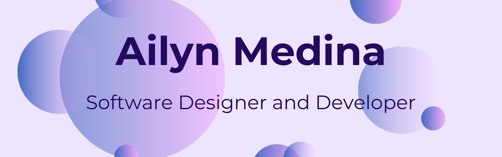

# ¡Hola! 👋🏻 Soy Ailyn Medina 

🎓 Estudiante de Diseño y Desarrollo de Software (4to ciclo)  
🚀 Apasionada por la tecnología, el diseño y el aprendizaje continuo  
💡 En constante exploración de nuevas herramientas, lenguajes y buenas prácticas  
🌐 Actualmente aprendiendo sobre desarrollo web y conceptos básicos de backend  

---

## 🛠️ Tecnologías que manejo

  
  
  
  
  

---

## 📌 Sobre mí

- 🔭 Actualmente estudiando en **Tecsup (4to ciclo)**
- 🌱 Aprendiendo: MongoDB, PHP (pronto Laravel), Python, Node.js con Express y JavaScript
- 👩‍💻 Explorando el desarrollo web y backend
- 💬 Me interesa crear páginas funcionales y bien diseñadas
- 📫 Contáctame: **ailynmedina00@gmail.com**
- ⚡ Dato curioso: *¡Siempre busco nuevas formas de aprender y mejorar! 😄*

---

## 🤝 Conecta conmigo

  
  
  
  
  

---

## 💻 Lenguajes y Herramientas

### Backend

  

### Frontend

  

### Bases de Datos

  

### Herramientas

  

---

  
  <em><b>¡Me encanta conectar con personas nuevas!</b> Si quieres saludar, <b>estaré feliz de conocerte 😊</b></em>

---

  Creado con 🧡 por <a href="https://github.com/lynmad05">Ailyn Medina</a>

